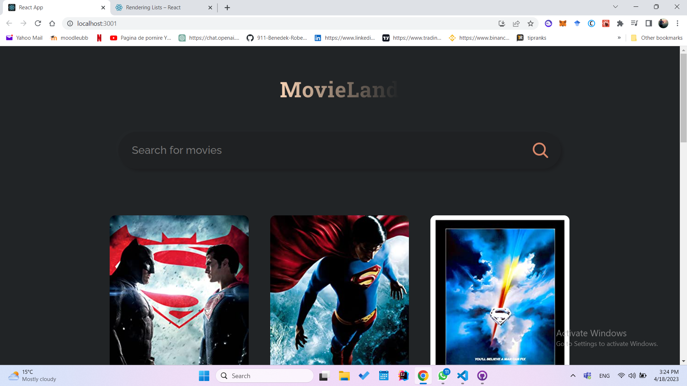

This is a React-based web application that allows users to search for movies by title using a search bar. The app fetches movie data from the IMDb API and returns a MovieCard component for each movie that matches the search query.

Each MovieCard displays information about the movie, including its title, release year, rating, and plot summary. Additionally, the MovieCard also displays a poster image of the movie, giving users a visual representation of the film.

One of the key features of this app is its mobile responsiveness. The layout and design of the app automatically adapt to different screen sizes, making it easy for users to access and use the app on their mobile devices.

Overall, this app provides a user-friendly and visually appealing way to search for and discover movies using the OMDB database.

Here are some screen shots of the app : 

  
  
 

 
 
